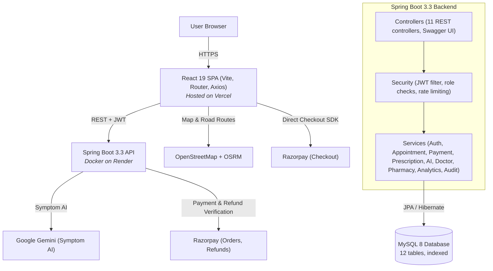
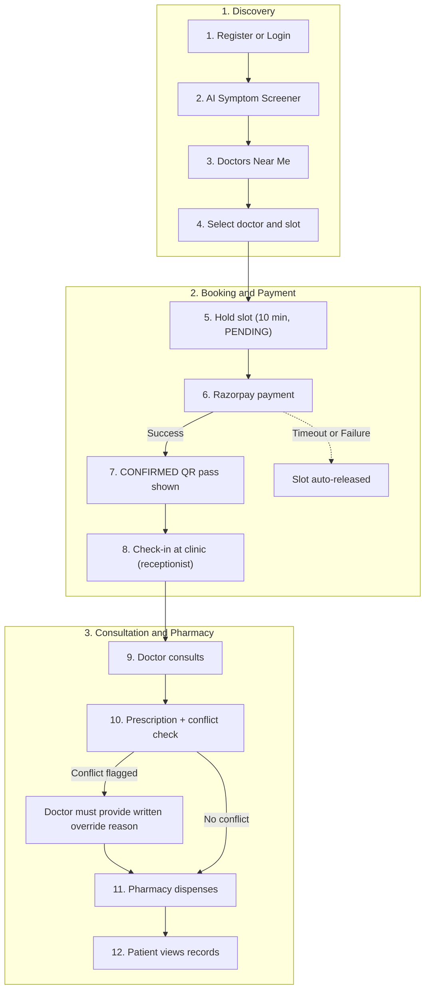
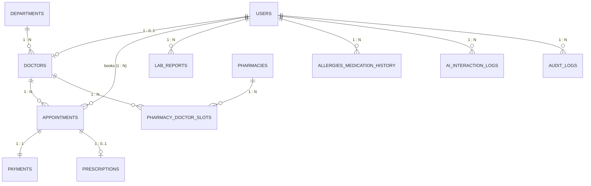

# 🏥 AuraHealth — Patient Health Portal

A full-stack, enterprise-grade, role-based **Patient Health Portal and Telehealth System** with AI-driven symptom assessment, proximity-based doctor discovery with real road-route mapping, concurrency-safe slot reservations, integrated Razorpay payments with instant QR check-in passes, allergy/drug-interaction safety validation, automated lab report extraction, and complete pharmacy/admin management.

---

## 2. Key Features

Every feature below is implemented in the codebase:

- **🤖 AI Symptom Screener**: Powered by Google Gemini AI to analyze patient symptoms, infer possible differential diagnoses, suggest the recommended specialist, and provide confidence metrics. If the API fails or no API key is provided, a built-in rule-based clinical engine automatically takes over. Rate-limited to 10 requests per minute using Bucket4j.
- **📍 Doctors Near Me**: Interactive Leaflet map with browser geolocation, server-side Haversine distance calculations and sorting, and real-time road-following routes retrieved from OSRM (with straight-line fallback).
- **📅 Slot Booking**: Hold slot for 10 minutes with optimistic concurrency control (`SELECT ... FOR UPDATE`), payment processing, and automatic status transition to `CONFIRMED`. Features an on-screen countdown timer, celebratory confetti upon success, and a verifiable on-screen QR booking pass.
- **💳 Razorpay Payments**: Secure order generation, server-side HMAC-SHA256 signature verification, automatic cancellation refunds, and built-in mock mode for presentations and testing.
- **🛡️ Prescriptions and Safety**: Automated drug-interaction matrix and safety engine that cross-references patient allergies, current medications, and co-prescribed drugs. A prescribing physician must provide an explicit clinical justification to override any flagged conflict.
- **📋 Lab Report Summaries**: Supports PDF and text lab report uploads. Apache PDFBox extracts clinical text and automatically flags abnormal ranges for Fasting Blood Sugar, HbA1c, Blood Pressure, Cholesterol, Haemoglobin, Creatinine, and WBC values.
- **💊 Pharmacy Module**: Multi-doctor visiting chambers configured with days, time slots, consultation room numbers, fees, and token limits; patient arrival check-in desk; and instant prescription dispensing workflow.
- **📊 Admin Analytics**: Comprehensive hospital metrics dashboard displaying total appointments, gross revenue, cancellation rate, department distribution, doctor load, complete audit trail logs, and doctor/pharmacy account approvals.
- **🌗 Theming**: Ultra-modern glassmorphism interface featuring seamless dark and light mode toggle and full mobile/desktop responsive layout.

---

## 3. User Roles and Access

Enforced on the backend with Spring Security role annotations (`@PreAuthorize`) on every endpoint and on the frontend with protected route guards.

| Role | What They Can Do | Main Pages |
| :--- | :--- | :--- |
| **Patient** | Symptom check, find doctors, book and pay, cancel or reschedule, view prescriptions, upload lab reports, manage allergies | `/patient/appointments`<br/>`/patient/profile`<br/>`/lab-reports` |
| **Doctor** | View appointments, write prescriptions with conflict check, reschedule or cancel, edit profile | `/doctor/dashboard`<br/>`/doctor/profile` |
| **Pharmacy / Receptionist** | Manage chamber slots, mark patient arrival, dispense prescriptions | `/pharmacy/dashboard` |
| **Admin** | Analytics, audit logs, approve or reject users, change roles, add departments | `/admin/analytics` |

> **Note:** Doctor and pharmacy sign-ups require admin approval before they can log in. Public pages include **Home (`/`)**, **Login (`/login`)**, **Register (`/register`)**, **Doctors Near Me (`/doctors`)**, and **AI Screener (`/ai-screener`)**.

---

## 4. System Architecture

A decoupled Single-Page Application (SPA) and REST API, deployed independently:



---

## 5. Workflow

The end-to-end patient journey across the AuraHealth platform:



---

## 6. Database Design

12 normalized tables with indexes on foreign keys, status, timestamp, and location columns:



### Table Definitions & Roles
1. `users` — Authentication, roles (`ROLE_PATIENT`, `ROLE_DOCTOR`, `ROLE_PHARMACIST_RECEPTIONIST`, `ROLE_ADMIN`), approval state.
2. `departments` — Medical specialties (Cardiology, Dermatology, Neurology, Orthopedics, General Medicine, Pulmonology).
3. `doctors` — Specialization, clinic address, geo-coordinates (`latitude`, `longitude`), consultation fees, rating, degree.
4. `appointments` — Patient, doctor, slot datetime, status (`PENDING`, `CONFIRMED`, `CANCELLED`, `COMPLETED`), 10-minute hold expiry, version for optimistic locking.
5. `payments` — Razorpay order ID, payment ID, signature, fee amount, status (`PENDING`, `SUCCESS`, `FAILED`, `REFUNDED`).
6. `prescriptions` — Linked appointment, diagnosis, medicines JSON, allergy/conflict override flag and justification, dispensing status.
7. `lab_reports` — File upload metadata, extracted raw text, flagged abnormal parameters, plain-English clinical summary.
8. `allergies_medication_history` — Patient documented allergies and active drug regimens with severity ratings.
9. `pharmacies` — Pharmacy licensing, clinic address, geo-coordinates, operating hours, approval state.
10. `pharmacy_doctor_slots` — Visiting doctor chambers, consultation room, visiting days, consultation hours, token limits.
11. `ai_interaction_logs` — Audited symptom prompts, Gemini AI responses, and disclaimer acceptance logs.
12. `audit_logs` — Immutable audit trail tracking user IDs, actions, entity targets, and timestamps.

---

## 📁 Project Structure

```
AuraHealth/
├── backend/                                      # Spring Boot 3.3 REST API
│   ├── pom.xml                                   # Dependencies (Spring Boot 3.3.2, PDFBox, Razorpay, JJWT, Bucket4j)
│   ├── .env.example                              # Environment configuration template
│   ├── src/main/java/com/healthportal/
│   │   ├── HealthPortalApplication.java          # App entrypoint & dotenv loader
│   │   ├── config/                               # Security, Swagger OpenAPI, and Data Initializer
│   │   ├── controller/                           # 11 REST controllers (Auth, Doctor, Appointment, Payment, etc.)
│   │   ├── dto/                                  # Request/response DTOs
│   │   ├── entity/                               # 12 JPA Entities (User, Doctor, Appointment, Payment, etc.)
│   │   ├── repository/                           # Spring Data JPA repositories with custom queries
│   │   ├── security/                             # JWT auth filters, RateLimiter, and UserDetailsService
│   │   └── service/                              # Core business logic (AI, Payment, Prescription safety, etc.)
│   └── src/main/resources/
│       └── application.yml                       # Spring datasource, JWT, Razorpay, and Gemini configs
├── frontend/                                     # React 19 + Vite SPA
│   ├── package.json                              # React 19, Leaflet, Axios, Lucide Icons, Vite
│   ├── index.html                                # App root & meta description
│   └── src/
│       ├── App.jsx                               # Role-protected routing configuration
│       ├── components/                           # Navbar, SlotBookingModal with QR generator
│       ├── context/                              # AuthContext (JWT) and ThemeContext (Dark/Light)
│       ├── pages/                                # Discovery, Dashboards, Profiles, Lab Reports, Analytics
│       ├── services/                             # Axios client with automatic JWT token attachment
│       └── utils/                                # Haversine distance, currency, doctor formatters
└── database.sql                                  # Complete MySQL 8 database schema with initial seed data
```

---

## 🚀 Running the Project Locally

### Prerequisites
- **Java 21** & **Maven**
- **Node.js 18+** & **npm**
- **MySQL 8.0+**

### 1. Database Initialization
Ensure MySQL 8 is running locally, then initialize the database:
```sql
CREATE DATABASE patient_portal;
```
*(Optionally import `database.sql` to populate sample doctors, visiting slots, departments, and seed data).*

### 2. Backend Startup
```bash
cd backend
# Edit .env with your MySQL credentials (DB_USER, DB_PASSWORD)
mvn spring-boot:run
```
- **Backend API**: `http://localhost:8082`
- **Swagger UI**: `http://localhost:8082/swagger-ui.html`

### 3. Frontend Startup
```bash
cd frontend
npm install
npm run dev
```
- **Frontend App**: `http://localhost:5173`

---

## 🔑 Demo Login Credentials

Pre-configured accounts (also available via 1-click demo buttons on the Login page):

| Role | Email | Password |
| :--- | :--- | :--- |
| **Admin** | `admin@health.com` | `admin123` |
| **Patient** | `patient@health.com` | `patient123` |
| **Doctor** | `dr.sharma@hospital.com` | `doctor123` |
| **Pharmacy / Receptionist** | `pharmacy@health.com` | `pharmacy123` |

---

## 📄 License
MIT License © 2025 AuraHealth Team
