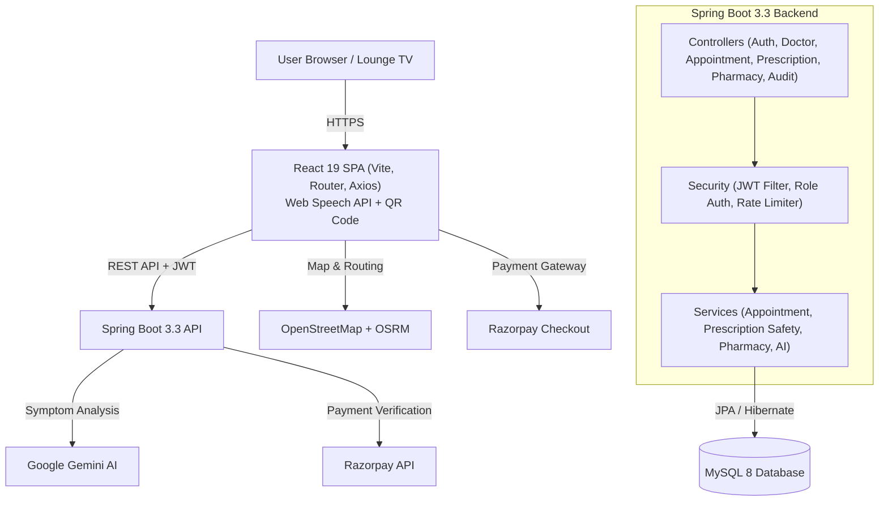

# 🏥 DoctorFinder & Clinic Chamber Management System (AuraHealth)

A full-stack, enterprise-grade **Doctor Discovery, Multi-Chamber Clinic Management, and Telehealth Platform** tailored for regional healthcare ecosystems. Features real-world multi-chamber doctor scheduling, live waiting lounge TV displays with voice announcements, hospital-grade QR OPD consultation slips, digital doctor prescription pads (Rx), pharmacy dispensing counters, doctor & patient attendance tracking, AI symptom screening, and regional bilingual support (English & বাংলা).

---

## 🌟 Key Features

### 1. 🏥 Real-World Multi-Chamber Scheduling Ecosystem
- Doctors visit multiple physical chambers across towns (e.g., *Uttarpara*, *Konnagar*, *Rishra*, *Serampore*, *Bally*, *Chandannagar*, *Chinsurah*, *Bandel*).
- Real clinic chambers (e.g., *Makhla Medicare Chemists & Polyclinic*, *Bengal Swasthya Chemists*, *Bhadrakali Seva Kendra*, *Station Road Chemists*).
- Each chamber specifies doctor sitting days, consultation hours (e.g., `10:00 AM - 12:30 PM` or `05:00 PM - 07:30 PM`), consultation fees, and token limits.
- Patients can discover doctors **by Locality/City** or **by Chamber Name**.

### 2. 📺 Fullscreen Waiting Lounge TV Display (`/chamber/live-display`)
- Purpose-built for TV screens mounted in clinic waiting areas.
- **Chamber Switcher**: Switch views across different clinic chambers.
- **Giant Glowing Token Board**: Displays `NOW CALLING: Token #07` with patient name, consultation room, and attending physician.
- **Native Audio Voice Chime (Web Speech API)**: Announces calls out loud:
  > *"Token number seven, please proceed to Chamber Room One for Dr. Vikram Sharma"*.
- **Next-in-Line Queue Table**: Shows upcoming tokens and estimated wait times.
- **Doctor Sitting Board**: Real-time physician status (`In Chamber`, `Consulting`, `Break`, `Expected`).

### 3. 📄 Hospital-Grade OPD Slip with Scannable QR Code
- Instant printable/downloadable OPD consultation slip for any booked appointment or walk-in.
- **Scannable QR Code** (via `qrcode.react`) encoding appointment token, chamber ID, doctor name, and verification URL.
- Detailed patient particulars (Name, Age, Phone, Blood Group).
- Chamber address, consultation slot, token badge, and payment status.
- Print-optimized (`@media print`) layout formatted for A4 and thermal printers.

### 4. 🩺 Doctor Digital Prescription Pad (Rx) with Auto-Routing
- Doctor console with integrated patient consultation history.
- Patient vitals recording (BP, Pulse, Weight, SpO2, Temperature).
- **Quick-Preset Medicine Selector** (Paracetamol, Amoxicillin, Pantoprazole, Cetirizine, Metformin, etc.) with frequency (`1-0-1`, `1-0-0`), timing (`Before Food`, `After Food`), and duration (`5 days`, `7 days`).
- **Automated Drug-Drug Conflict Warning Engine**: Cross-references patient allergy records and active medications.
- **Instant Pharmacy Auto-Routing**: Saved prescriptions immediately appear on the attached pharmacy's dispensing counter.

### 5. 💊 Pharmacy Dispensing Desk & Clinic Operations
- **Prescription Dispensing Desk**: Itemized medicine checklists, prices, dosage instructions, and 1-click `Mark as Dispensed`.
- **Doctor & Patient Attendance Tracker (`/pharmacy/attendance`)**:
  - Live Doctor Arrival/Departure marking (`IN`, `OUT`, `EXPECTED`).
  - Patient Queue Flow tracking (`WAITING`, `WITH_DOCTOR`, `EXITED`).
- **Doctors Directory & Locality Contacts (`/pharmacy/doctors`)**: Direct contacts and chamber roster for all visiting physicians.

### 6. 🌐 Regional Bilingual Localization (English / বাংলা)
- Built-in language switcher (`বাংলা` / `EN`) in the navigation bar.
- Regional translations for Bengali-speaking clinic staff, patients, and waiting room TV displays.

### 7. 🤖 AI Symptom Screener & Proximity Discovery
- Powered by Google Gemini AI (with a clinical rule-based fallback).
- Interactive Leaflet map with browser geolocation and Haversine distance calculations.
- Concurrency-safe slot reservation with 10-minute hold and Razorpay checkout.

---

## 👥 User Roles & Access

| Role | What They Can Do | Main Pages |
| :--- | :--- | :--- |
| **Patient** | Find doctors by city/chamber, book token, track live queue, print OPD QR slip, view digital Rx, AI screener | `/dashboard`<br/>`/doctors`<br/>`/chambers` |
| **Doctor** | View today's patient queue, write digital prescriptions (Rx) with conflict check, track consultations | `/doctor-dashboard` |
| **Pharmacy / Receptionist** | Manage doctor slots, track doctor & patient attendance (IN/OUT), dispense medicines, launch TV display | `/pharmacy-reception`<br/>`/pharmacy/attendance`<br/>`/pharmacy/doctors`<br/>`/pharmacy/chambers` |
| **Admin** | Hospital analytics, revenue, audit logs, doctor/pharmacy approvals, chamber oversight | `/admin-dashboard` |

---

## 🔑 Demo Login Credentials

Pre-configured demo accounts (also available via 1-click quick login buttons on the `/login` page):

| Role | Email | Password |
| :--- | :--- | :--- |
| **Patient** | `patient@health.com` | `patient123` |
| **Doctor** | `dr.sharma@hospital.com` | `doctor123` |
| **Pharmacy / Receptionist** | `pharmacy@health.com` | `pharmacy123` |
| **Admin** | `admin@health.com` | `admin123` |

---

## 📖 Step-by-Step User Testing Guide

### Scenario 1: Patient Discovery, Booking & OPD Slip
1. Go to the **Home Page (`/`)**.
2. Select your city (e.g., *Uttarpara*) or click **"Browse by Chambers"** to view clinics like *Makhla Medicare*.
3. Click **"Book Appointment"** on a doctor (e.g., *Dr. Vikram Sharma*).
4. Select a date and chamber slot (e.g., `Chamber 1: 05:00 PM - 07:30 PM`), then confirm booking.
5. In your **Patient Dashboard (`/dashboard`)**:
   - Observe the **Live Queue Status Box** (*"Calling Token #07 • You are Token #09 • 2 patients ahead"*).
   - Click **"Print OPD Slip"** to view and print your official consultation slip with a scannable QR code.

### Scenario 2: Doctor Consultation & Prescription Writing
1. Log in as Doctor (`dr.sharma@hospital.com` / `doctor123`).
2. Go to **Doctor Dashboard (`/doctor-dashboard`)**.
3. Under today's appointments, click **"Prescribe Rx"** on the patient.
4. Input vitals, select prescribed medicines using the quick presets, and specify dosage notes.
5. Click **"Save & Send to Pharmacy"**. The prescription is saved and synced to the pharmacy desk.

### Scenario 3: Pharmacy Dispensing & Attendance Tracking
1. Log in as Pharmacy (`pharmacy@health.com` / `pharmacy123`).
2. **Dispensing**: On `/pharmacy-reception`, view incoming prescriptions under *Prescription Dispensing Desk*. Review the medicine checklist and click **"Mark as Dispensed"**.
3. **Attendance**: Navigate to `/pharmacy/attendance`.
   - Update doctor status to **IN Chamber** or **Out**.
   - Check in visiting patients and move them through **WAITING** ➔ **WITH DOCTOR** ➔ **EXITED**.
4. **Contacts**: Navigate to `/pharmacy/doctors` to view the phone numbers and localities of all visiting doctors.

### Scenario 4: Waiting Lounge TV Display (with Voice Chime)
1. Open `/chamber/live-display` (or click **"Live TV Display"** / **"টিভি স্ক্রিন"** in the top navigation).
2. Choose your chamber (e.g., *Makhla Medicare*).
3. Hear the native audio voice announcement calling the current token number.
4. View the live roster of consulting physicians and upcoming tokens.

---

## 🏗️ System Architecture



---

## 📁 Project Structure

```
AuraHealth/
├── backend/                                      # Spring Boot 3.3 REST API
│   ├── pom.xml                                   # Dependencies (Spring Boot 3.3.2, PDFBox, Razorpay, JJWT, Bucket4j)
│   ├── .env.example                              # Environment configuration template
│   ├── src/main/java/com/healthportal/
│   │   ├── HealthPortalApplication.java          # App entrypoint & dotenv loader
│   │   ├── config/                               # Security, Swagger OpenAPI, and DataInitializer
│   │   ├── controller/                           # REST controllers (Auth, Doctor, Appointment, Prescription, etc.)
│   │   ├── dto/                                  # Request/response DTOs
│   │   ├── entity/                               # JPA Entities (User, Doctor, Appointment, Prescription, Pharmacy, etc.)
│   │   ├── repository/                           # Spring Data JPA repositories
│   │   ├── security/                             # JWT auth filters, RateLimiter, and UserDetailsService
│   │   └── service/                              # Core business logic (AI, Payment, Prescription safety, Pharmacy)
│   └── src/main/resources/
│       └── application.yml                       # Spring datasource, JWT, Razorpay, and Gemini configs
├── frontend/                                     # React 19 + Vite SPA
│   ├── package.json                              # React 19, Leaflet, Axios, Lucide Icons, Vite, qrcode.react
│   └── src/
│       ├── App.jsx                               # Role-protected routing configuration & LanguageProvider
│       ├── components/                           # Navbar, OpdSlipModal (QR), PrescriptionModal, SlotBookingModal
│       ├── context/                              # AuthContext (JWT), ThemeContext (Dark/Light), LanguageContext (EN/BN)
│       ├── data/                                 # chambersData.js (Regional clinic chambers & doctor rosters)
│       ├── pages/
│       │   ├── ChamberLiveDisplay.jsx            # Fullscreen Waiting Lounge TV View with Voice Chime
│       │   ├── PharmacyAttendance.jsx            # Doctor & Patient In/Out Attendance Console
│       │   ├── PharmacyDoctors.jsx               # Doctors Directory & Locality Contacts
│       │   ├── PharmacyChambers.jsx              # Chamber schedule management
│       │   ├── PharmacyReceptionDashboard.jsx    # Pharmacy Desk & Medicine Dispenser
│       │   ├── PatientDashboard.jsx              # Patient queue tracker, OPD slip, and Rx viewer
│       │   ├── DoctorDashboard.jsx               # Doctor consultation console & Rx prescriber
│       │   ├── AdminDashboard.jsx                # Analytics, audit logs, approvals
│       │   └── Home.jsx                          # Landing page with city/chamber discovery
│       ├── services/                             # Axios client with automatic JWT token attachment
│       └── utils/                                # Haversine distance, currency, doctor formatters
└── README.md
```

---

## 🚀 Running Locally

### Prerequisites
- **Java 21** & **Maven**
- **Node.js 18+** & **npm**
- **MySQL 8.0+**

### 1. Database Setup
```sql
CREATE DATABASE patient_portal;
```

### 2. Backend Startup
```bash
cd backend
mvn spring-boot:run
```
- API Base URL: `http://localhost:8080`
- Swagger Documentation: `http://localhost:8080/swagger-ui/index.html`

### 3. Frontend Startup
```bash
cd frontend
npm install
npm run dev
```
- Web Application: `http://localhost:5173`

---

## 📄 License
MIT License © 2025 AuraHealth Team
